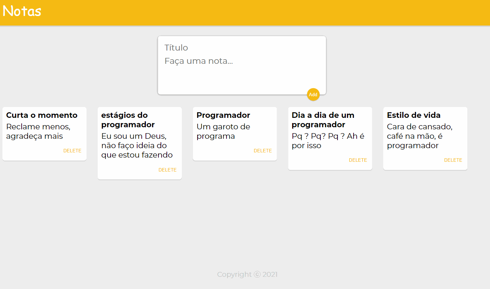

## :rocket: **Notes**

Annotation project done with React, its purpose is to test components, states and properties.

<div align="center">
    
</div>

## :arrow_forward: **Run**

To run the project you need to clone or download this repository, have the Node Package Manager (NPM) or the YARN Package Manager installed (YARN).

```bash
$ git clone https://github.com/evertonvargas/keeper.git
$ cd notas
```

Follow the steps below:
```bash
# Install the dependencies
$ yarn

# Start the project
$ yarn start
```
The app will be available for access on your browser at http://localhost:3000
